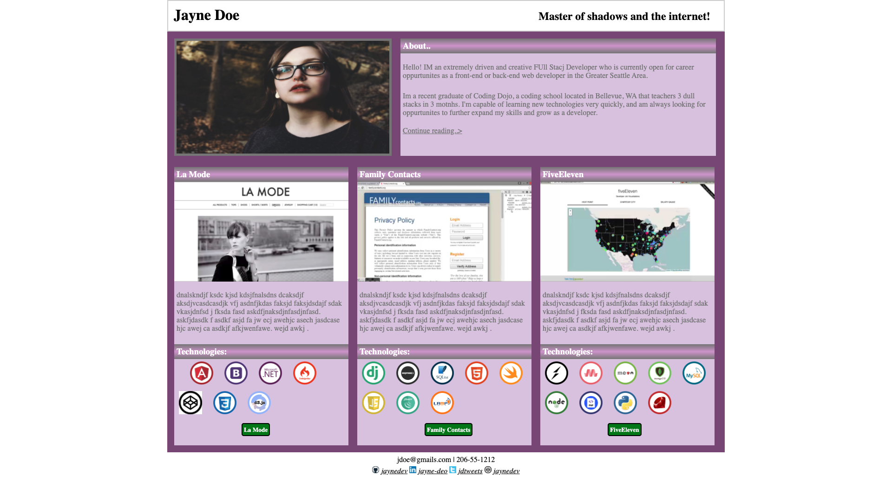

# PortfolioExample
  A page I created while learning to code at the Coding Dojo. It is an example of somones website portfolio showcasing their skills.
  
# What I learned
  * Practice HTML/CSS
  * Background color gradient
  * Card implementation
  
# Screenshots

